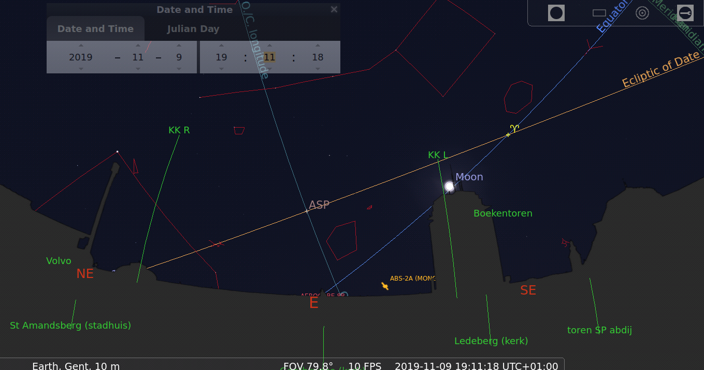
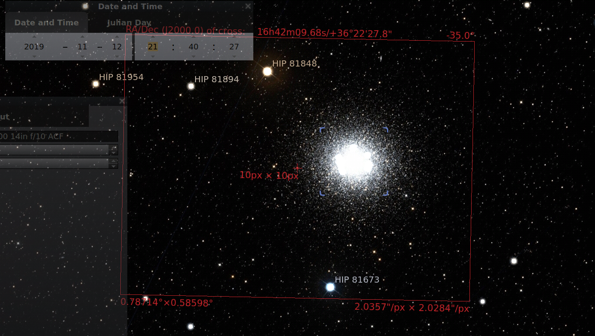
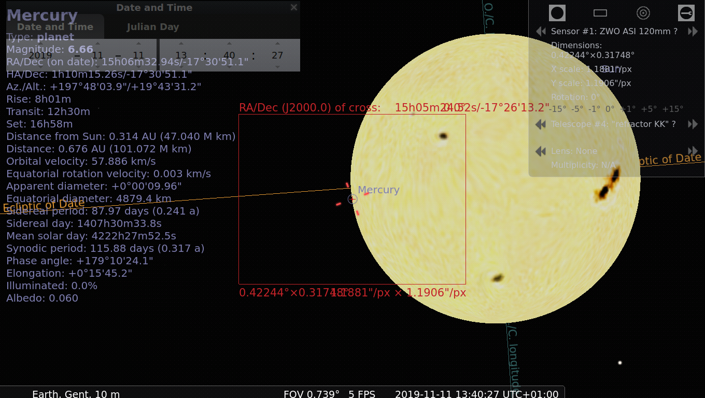
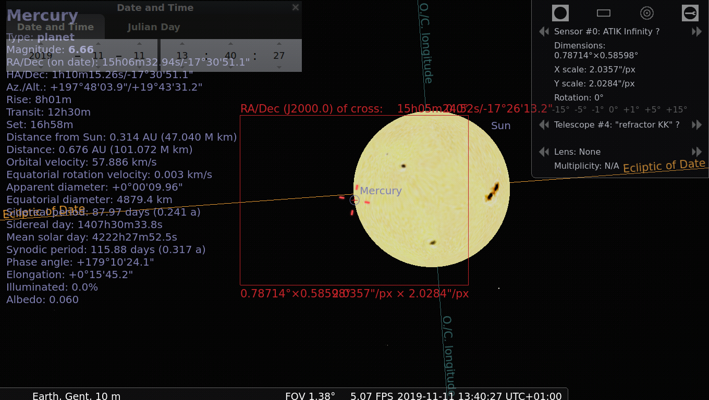
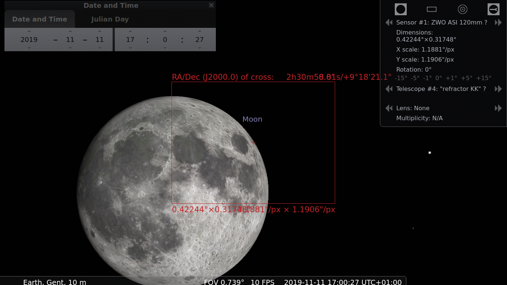
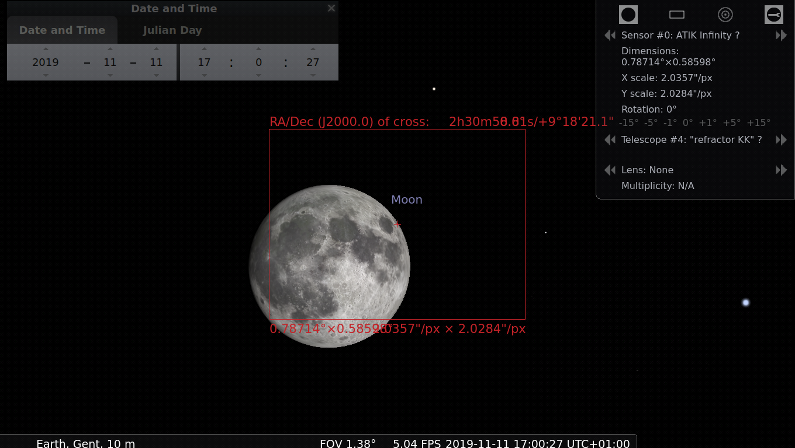
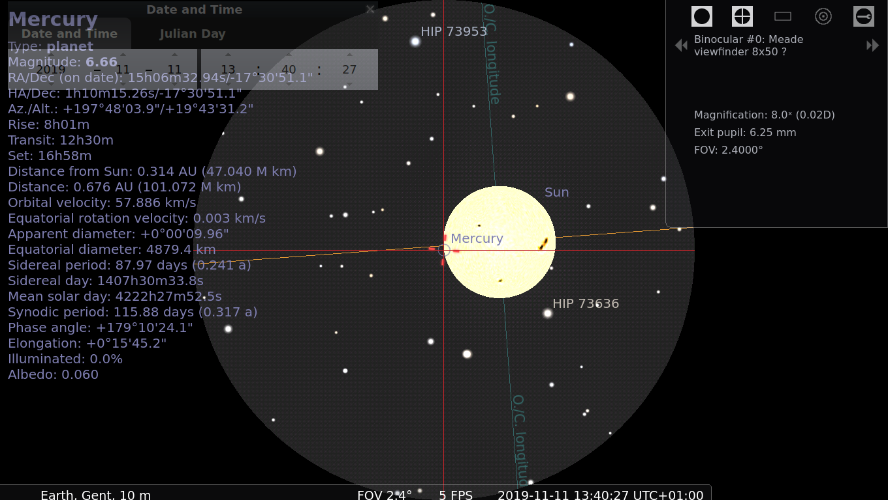

=============
vsrug-oculars
=============

VSRUG ocular plugin collection for use in Stellarium.

Copy this file as `ocular.ini` to your local Stellarium config directory (it contains `config.ini`) under `modules/Oculars/`.

Unfortunately, there is currently no way to cleanly merge ocular data from several organisations/places.

- Windows users can best rename the existing file before/after use, in order to keep whatever they created locally
- Linux users are lucky: they can use symlinks.

Some images
-----------

.. image:: img/stellarium-094.png

.. image:: img/stellarium-105.png
.. image:: img/stellarium-106.png

.. image:: img/stellarium-111.png
.. image:: img/stellarium-112.png
.. image:: img/stellarium-114.png

