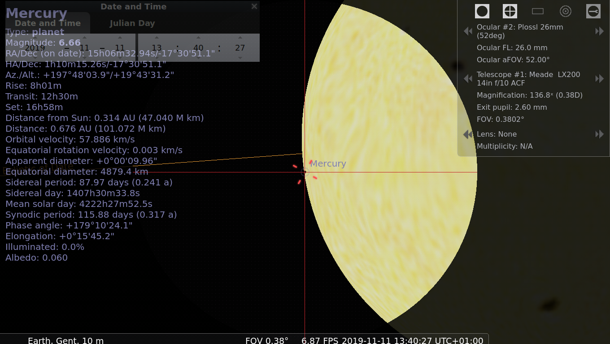
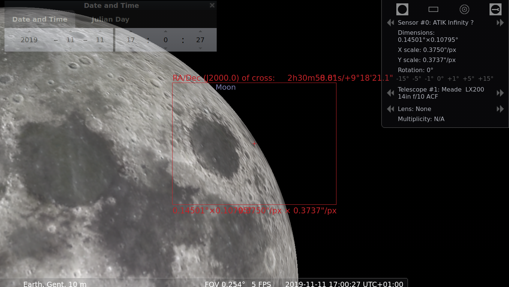
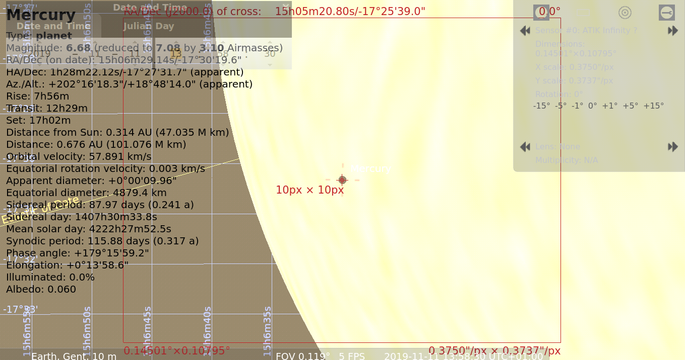

=============
vsrug-oculars
=============

.. contents:: 

VSRUG ocular plugin collection for use in Stellarium.

Copy this file as `ocular.ini` to your local Stellarium config directory (it contains `config.ini`) under `modules/Oculars/`.

Unfortunately, there is currently no way to cleanly merge ocular data from several organisations/places.

- Windows users can best rename the existing file before/after use, in order to keep whatever they created locally
- Linux users are lucky: they can use symlinks.

Some images
===========

Meade LX-200 ACF
----------------

.. image:: img/stellarium-105.png
ZWO

.. image:: img/zwo130.png
ZWO 130 Mercury 2019 transit

.. image:: img/stellarium-106.png
Infinity

vis

"refractor KK"
--------------

.. image:: img/stellarium-103.png
ZWO

.. image:: img/stellarium-104.png
Infinity

.. image:: img/stellarium-115.png
vis
        
.. image:: img/stellarium-118.png
Celestron        

Varia
-----

.. image:: img/stellarium-094.png
.. image:: img/stellarium-098.png
Test van Ivo: M13, M27

.. image:: img/stellarium-109.png
.. image:: img/stellarium-110.png
.. image:: img/stellarium-111.png

(Maan)

 Varia
 
.. image:: img/stellarium-116.png

.. image:: img/stellarium-087.png
VSRUG landscape (https://github.com/axd1967/vsrug-ls-gr)

