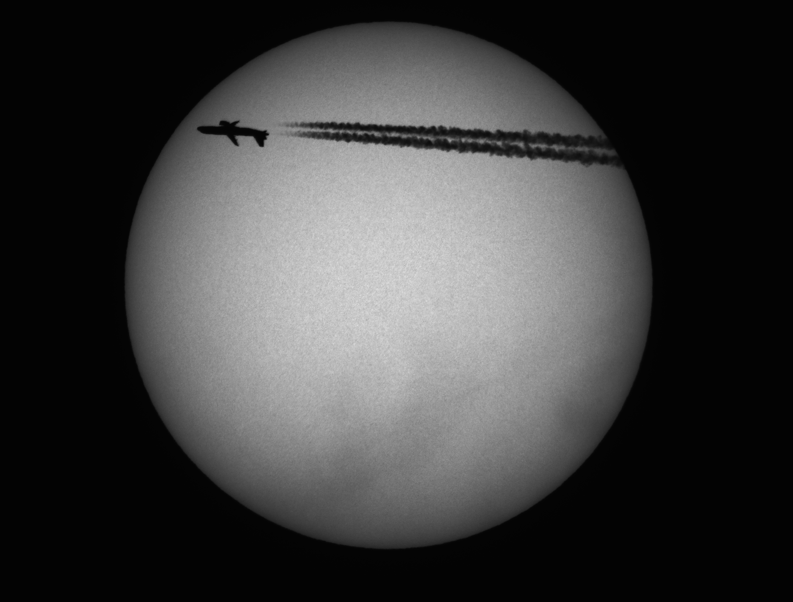
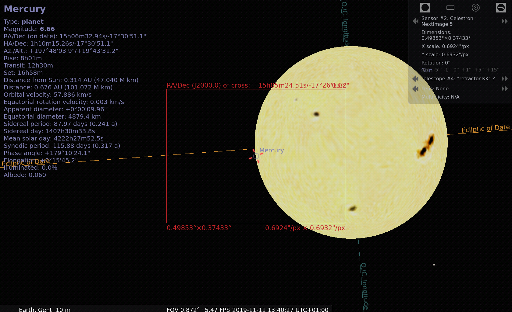

=======
Gallery
=======

.. contents:: 

.. warning:: ocular data is not precise/confirmed yet.

Tested
------

Ivo's "66/400"
++++++++++++++

Image (2019)

Stellarium 0.19.2

Orion / Trapezium M42 1944x1944

Stellarium 0.19.3

Meade LX-200 ACF?
-----------------

.. image:: stellarium-105.png
ZWO

.. image:: stellarium-106.png
Infinity

.. image:: stellarium-114.png
vis

"refractor AST?"
----------------

ZWO 130 Mercury 2019 transit (https://youtu.be/NsHJMcvNs0c?t=5715)

ZWO 130?

.. image:: stellarium-103.png
ZWO

.. image:: stellarium-104.png
ATIK Infinity?

.. image:: stellarium-115.png
vis?
        

Celestron?

Varia
-----

.. image:: stellarium-098.png
Test van Ivo: M13, M27

.. image:: stellarium-109.png
.. image:: stellarium-110.png

.. image:: stellarium-112.png
(Maan)

 Varia
 
.. image:: stellarium-116.png
.. image:: stellarium-117.png

.. image:: stellarium-087.png
VSRUG landscape (https://github.com/axd1967/vsrug-ls-gr)

